# Physics-Guided ML for Friction Stir Welding

<p align="center">
  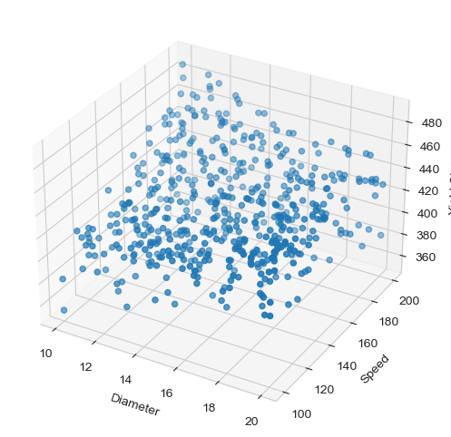
</p>

<p align="center">
  
  
  
  
</p>

This repository studies **yield strength prediction in Friction Stir Welding (FSW)** using a physics-guided machine learning workflow. It starts with process parameters, builds physics-informed features, expands the data using response surface modeling and Latin Hypercube Sampling, and trains regression models for process-property prediction.

The main idea is simple: when experimental welding data is limited, physics-aware augmentation can create a larger training set while keeping the generated samples inside realistic FSW behavior.

## Project Snapshot

| Area | What is included |
| --- | --- |
| Domain | Friction Stir Welding process modeling |
| Target | Yield strength prediction |
| Core inputs | Shoulder diameter `D`, welding speed `V`, rotational speed `N` |
| Physics features | Heat input index, rotational pitch, tool peripheral velocity |
| Augmentation | Response Surface Methodology, polynomial regression, Latin Hypercube Sampling |
| ML models | Random Forest, Gradient Boosting, XGBoost |
| Outputs | Augmented CSV data, notebooks, scripts, saved `.pkl` models, visual diagnostics |

## Visual Workflow

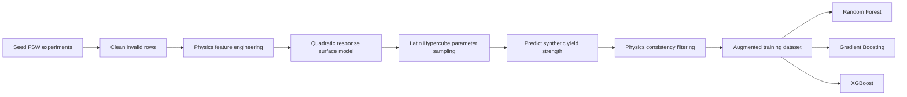

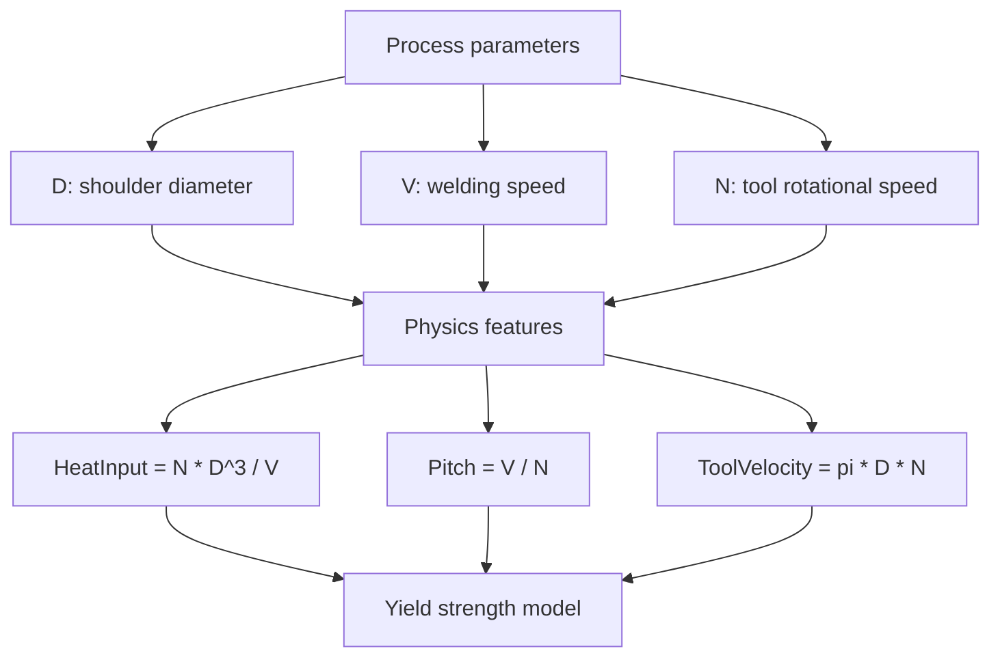

## Dataset

The augmentation notebook begins with 14 manually entered rows, removes the invalid zero-parameter row, and uses the 13 valid seed experiments to generate a 550-row augmented dataset. The CSV files currently committed in this repository are already training-ready exports.

| File | Rows | Columns | Role |
| --- | ---: | --- | --- |
| `fsw_clean_dataset.csv` | 550 | `D`, `V`, `N`, `HeatInput`, `Yield` | Clean/training-ready dataset used by Random Forest and XGBoost scripts |
| `augmented_data.csv` | 550 | `D`, `V`, `N`, `Yield`, `HeatInput`, `Pitch`, `ToolVelocity` | Physics-feature dataset used by the augmentation and Gradient Boosting workflow |

### Parameter Ranges

| Feature | Meaning | Min | Max | Mean |
| --- | --- | ---: | ---: | ---: |
| `D` | Shoulder diameter, mm | 10.000 | 20.000 | 15.031 |
| `V` | Welding speed, mm/min | 100.000 | 200.000 | 151.398 |
| `N` | Tool rotational speed, rpm | 600.000 | 1000.000 | 797.759 |
| `HeatInput` | Heat input index | 3000.000 | 80000.000 | 20968.650 |
| `Pitch` | Rotational pitch | 0.100 | 0.333 | 0.194 |
| `ToolVelocity` | Tool peripheral velocity | 18849.556 | 62831.853 | 37677.913 |
| `Yield` | Yield strength, MPa | 353.700 | 489.044 | 423.882 |

## Exploratory Visuals

<p align="center">
  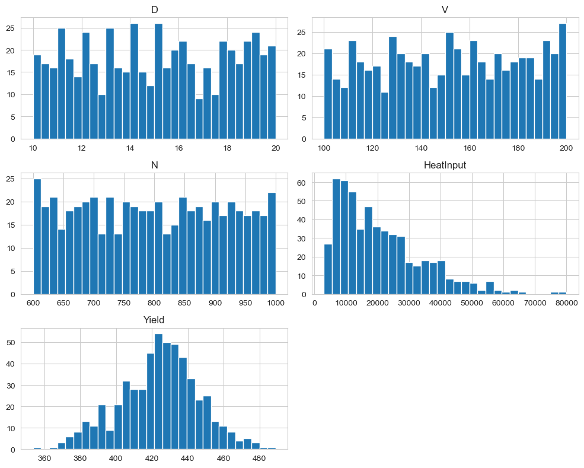
  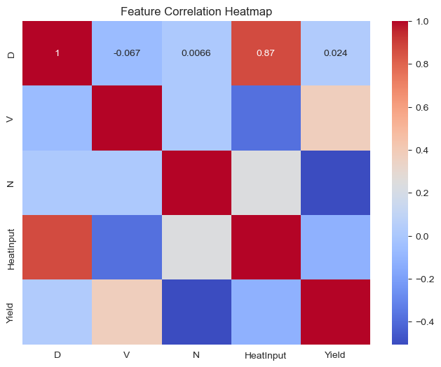
</p>

<p align="center">
  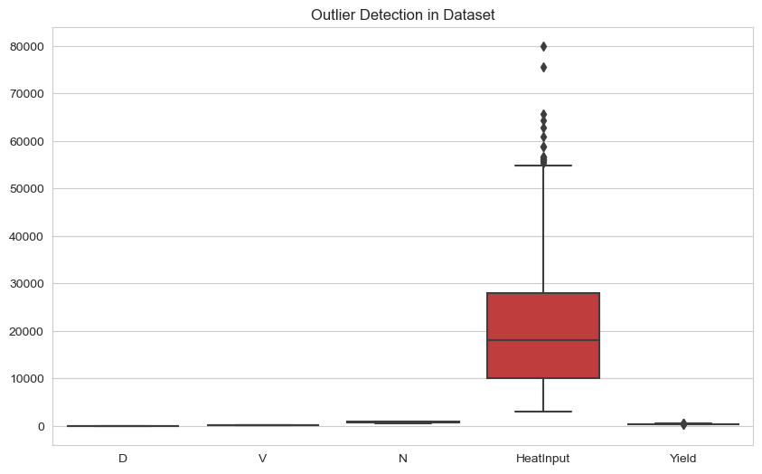
  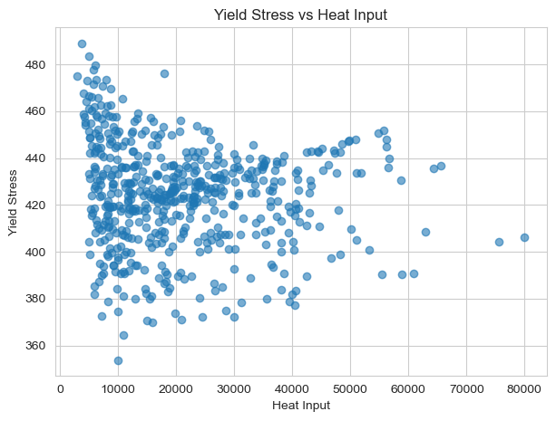
</p>

<p align="center">
  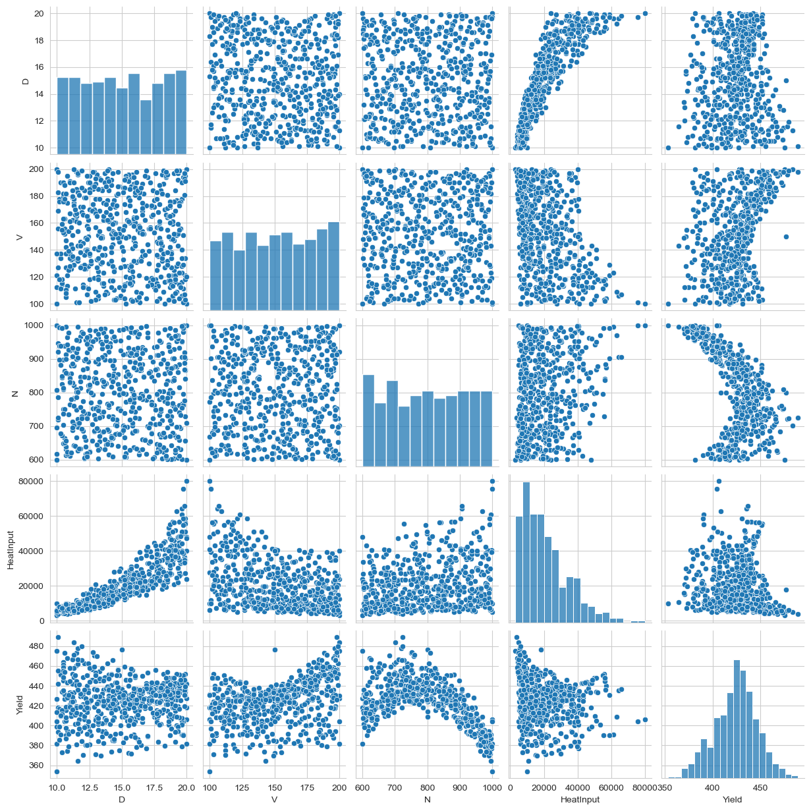
</p>

## Augmentation Method

1. **Clean the seed data**
   Rows with zero process parameters are removed because they do not represent physically meaningful FSW experiments.

2. **Create physics-guided features**

   ```text
   HeatInput = (N * D^3) / V
   Pitch = V / N
   ToolVelocity = pi * D * N
   ```

3. **Fit a response surface**
   A degree-2 polynomial feature set is passed into a linear regression model to approximate the relationship between welding parameters and yield strength.

4. **Sample new process settings**
   Latin Hypercube Sampling generates candidate values inside the chosen operating window:

   | Parameter | Minimum | Maximum |
   | --- | ---: | ---: |
   | `D` | 10 | 20 |
   | `V` | 100 | 200 |
   | `N` | 600 | 1000 |

5. **Predict and filter synthetic rows**
   The response surface predicts yield strength, then the synthetic samples are filtered to keep physically reasonable values.

6. **Export the final data**
   The final augmented data is saved to `augmented_data.csv`.

## Model Results

These metrics are taken from the current notebook outputs and should be regenerated after changing the data, random seed, or model parameters.

| Model | Dataset | Task | R2 | MAE | RMSE | Extra metrics |
| --- | --- | --- | ---: | ---: | ---: | --- |
| Random Forest | `fsw_clean_dataset.csv` | Regression | 0.9128 | 3.5206 | 7.2146 | 200 estimators |
| Gradient Boosting | `augmented_data.csv` | Regression | 0.9707 | - | 3.6527 | 300 estimators, learning rate 0.05 |
| XGBoost | `fsw_clean_dataset.csv` | Regression | 0.9198 | 3.0355 | 6.9171 | 300 estimators, max depth 5 |
| XGBoost Classifier | `fsw_clean_dataset.csv` | Yield > 430 MPa | - | - | - | Accuracy 0.9364, precision 0.9787, recall 0.8846 |

<p align="center">
  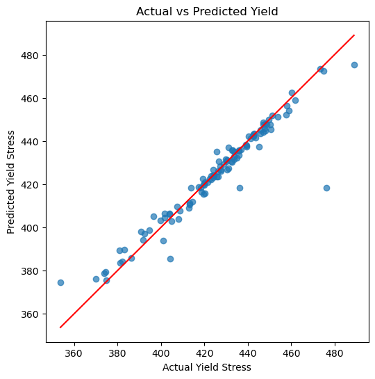
  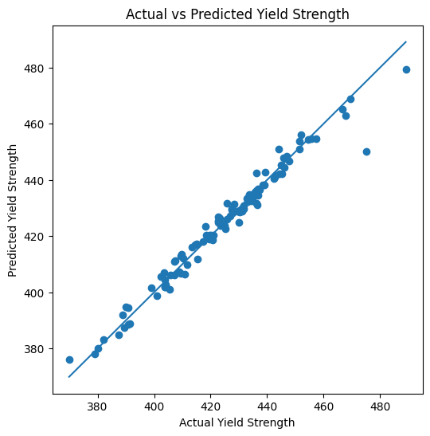
  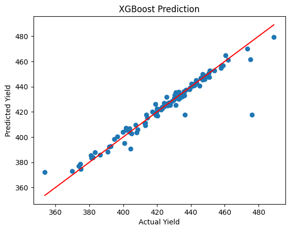
</p>

<p align="center">
  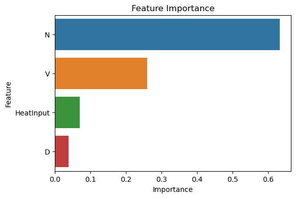
  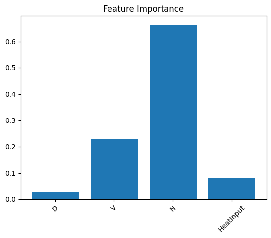
  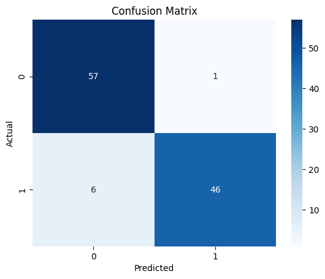
</p>

<p align="center">
  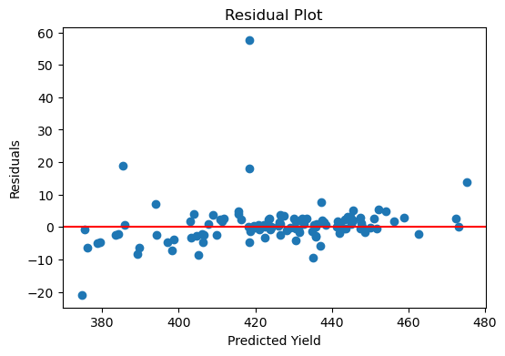
</p>

## Repository Structure

```text
FSW-ML/
|-- README.md
|-- requirements.txt
|-- fsw_clean_dataset.csv
|-- augmented_data.csv
|-- data_augmentation.ipynb
|-- visualisation.ipynb
|-- assets/
|   `-- readme/
|       |-- dataset and correlation plots
|       `-- model result plots
|-- Models/
|   |-- gradient_boost_model_train.ipynb
|   |-- GradientBoost/
|   |   |-- gradient_boost_model_train.ipynb
|   |   `-- gradient_boost_fsw_model.pkl
|   |-- RandomForest/
|   |   |-- random_forest.ipynb
|   |   `-- fsw_random_forest_model.pkl
|   `-- XGBoost/
|       `-- xg_boost.ipynb
`-- Models(Python files)/
    |-- random_forest_model.py
    |-- gradient_boost_model.py
    `-- xgboost_model.py
```

## How to Run

Clone the repository and install the dependencies:

```bash
git clone https://github.com/SatyaxLac/FSW-ML.git
cd FSW-ML
python -m venv .venv
```

On Windows PowerShell:

```powershell
.\.venv\Scripts\Activate.ps1
pip install -r requirements.txt
```

On macOS or Linux:

```bash
source .venv/bin/activate
pip install -r requirements.txt
```

Launch notebooks from the repository root so the relative CSV paths resolve correctly:

```bash
jupyter notebook
```

Recommended notebook order:

1. `data_augmentation.ipynb`
2. `visualisation.ipynb`
3. `Models/RandomForest/random_forest.ipynb`
4. `Models/GradientBoost/gradient_boost_model_train.ipynb`
5. `Models/XGBoost/xg_boost.ipynb`

To run the standalone model scripts:

```bash
cd "Models(Python files)"
python random_forest_model.py
python gradient_boost_model.py
python xgboost_model.py
```

## Saved Model Artifacts

| Artifact | Model |
| --- | --- |
| `Models/RandomForest/fsw_random_forest_model.pkl` | Random Forest regressor |
| `Models/GradientBoost/gradient_boost_fsw_model.pkl` | Gradient Boosting regressor |

## Applications

This project can be used as a starting point for:

- FSW yield strength prediction
- Process parameter sensitivity analysis
- Data augmentation for small manufacturing datasets
- Welding process optimization studies
- Comparing tree-based regressors on physics-guided features

## Important Notes

- Synthetic rows are model-guided estimates, not replacements for physical weld experiments.
- The trained models are most reliable inside the sampled ranges shown above.
- Re-run the notebooks if you change the dataset, sampling bounds, or model settings.
- The plotted images in `assets/readme/` were extracted from the notebooks so the README reflects the actual project outputs.
